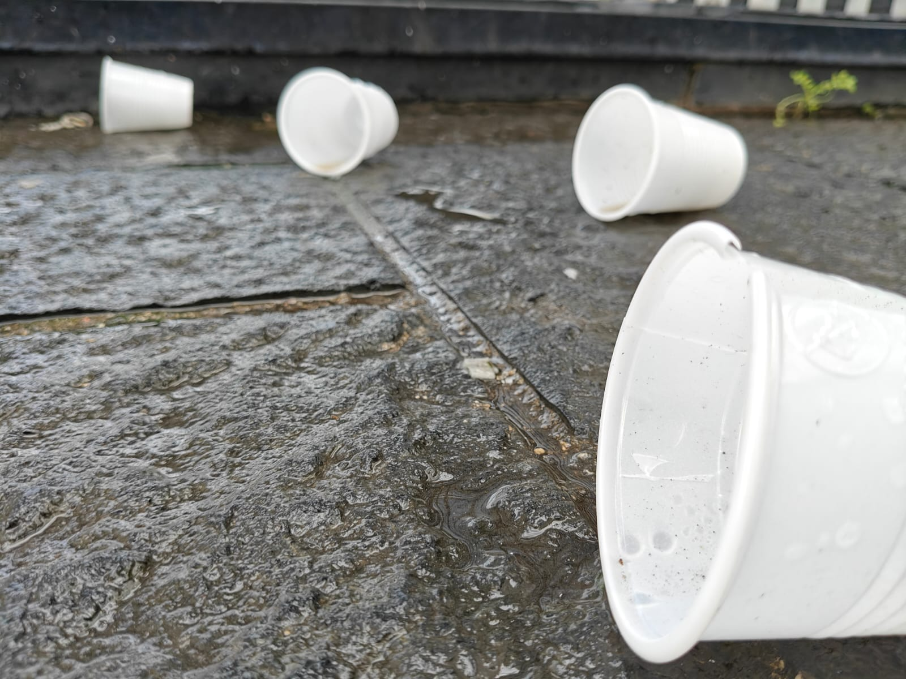
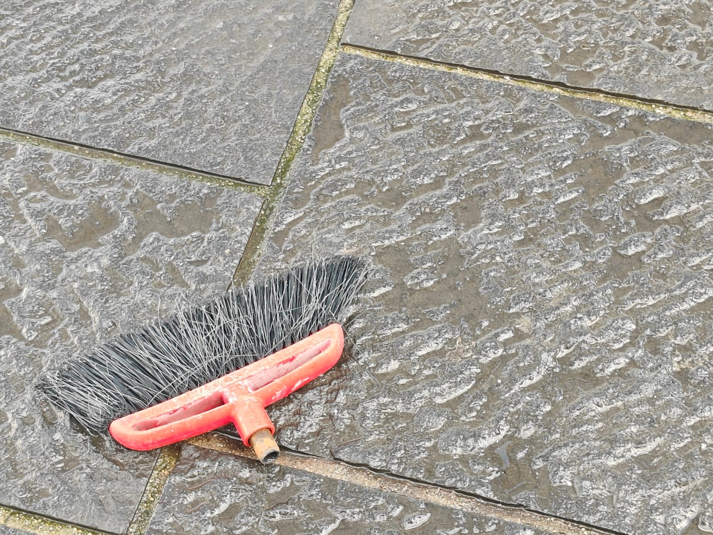

---

---
# Sopralluogo mercatini
Attraverso vari sopralluoghi con diversi geuppi, il nostro prevedeva di cercare di valorizzare la piazza riconoscendo gli elementi più importanti di questa e che la caratterizzano, ossia i mercatini.

{ width="400" } { width="400" }

{ width="400" } { width="400" }

{ width="400" } { width="400" } 

# Sopralluoghi inciviltà 
Questo sopralluogo è dovuto al ricorso e urgenza riguardo l'inquinamento e inciviltà che purtroppo caratterizza la nostra città. elemento sicuramente non bello ma importante.
---

---

{ width="400" }  { width="400" }

{ width="400" } { width="400" }

{ width="400" } { width="400" }

{ width="400" } { width="400" }

{ width="400" } { width="400" }

{ width="400" } { width="400" }

{ width="400" }

